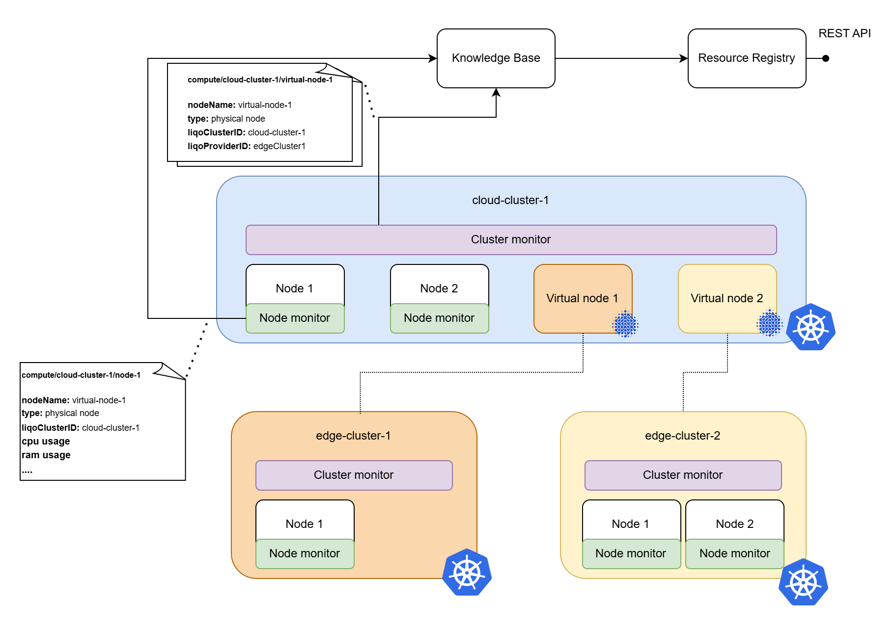

# Myrtus monitor service

## 🌿 MYRTUS Project Component

Unlocking the living dimension of Cyber-Physical Systems across the computing continuum.

## 🧭 Overview

This repository is part of the [MYRTUS Project](https://myrtus-project.eu/),
an EU initiative that pioneers a new generation of Cyber-Physical Systems (CPS) by embracing the principles of the EUCloudEdgeIoT Initiative.

MYRTUS envisions a unified computing continuum where 🌐 edge, ☁️ cloud, and ⚙️ fog environments cooperate seamlessly.
To achieve this, it reinvents programming models, languages, and orchestration tools for collaborative, distributed, and decentralized systems.

## Architecture

The monitoring service is a component that collects metrics from the Kubernetes cluster where it operates, as well as from its node, and transmits them to the Myrtus knowledge base component.
There are two flavors of the monitor service running in the cluster:

- **Node monitor service**: a Daemonset, running on each physical node of the cluster, retrieving info and resources available in the cluster
- **Cluster monitor service**: a single instance per cluster, retrieves info about the current cluster (e.g. the Liqo virtual nodes present in the cluster)



To simplify the collection and definition of diverse metrics, the Monitor service should follow a modular approach. The idea is splitting the application into collectors.

A collector is a component of the Monitor service which scrapes a set of metrics, parses them, and returns the collected metrics to the Monitor service core
When the monitor service starts it:

1. Checks the available collectors and initialize them
2. Executes each of the collectors with the specified periodicity
3. Sends the collected metrics to the [knowledge base endpoint](https://gitlab.abinsula.com/myrtus/mirto/interfaces/-/blob/main/knowledgebase_api/knowledge_base_v1_openapi.yaml?ref_type=heads)
The collected metrics are pushed in `json` format on the `mirto:deployer:computes` namespace under `liqo-cluster-id/node-name`

### Node monitor service

The node monitor service runs a DaemonSet in each Kubernetes cluster of the Myrtus architecture. It has a set of collectors that gather metrics about the resources available on the node where the node monitor service is running (e.g., CPU, RAM, GPU, FPGA availability, etc.), along with additional data about the identity of the node.

The snippet below shows an example of metrics produced by the node monitor service:

```json
{
    "node_name": "node01",
    "liqo_cluster_id": "edge-cluster-01",
    "type": "node",
    "cpu": {
        "used": 2480,
        "total": 8000,
        "physical": 8000,
        "timestamp": 1749653169.9923925
    },
    "disk": {
        "partitions": [
            {
                "device": "/dev/sda2",
                "mountpoint": "/",
                "total": 268407128064,
                "used": 146974105600
            }
        ],
        "total": 268407128064,
        "used": 146974105600,
        "timestamp": 1749653169.9930716
    },
    "memory": {
        "total": 16728895488,
        "used": 8805249024,
        "timestamp": 1749653169.9932094
    },
    "swap": {
        "total": 4115656704,
        "used": 19922944,
        "timestamp": 1749653169.993385
    }
    ...other metrics...
}
```

### Cluster monitor service

The cluster monitor service runs as single instance in each cluster of Myrtus architecture, it collects info about the Liqo Virtual nodes running in the cluster:

```json
{
    "node_name": "virtual-node-01",
    "type": "virtual",
    "liqo_cluster_id": "cloud-cluster-03",
    "liqo_provider_id": "edge-cluster-01"
}
```

These details can be used to identify the cloud cluster that serves as an entry point for scheduling workloads on specific nodes within an edge cluster.
The virtual node acts as a bridge between the edge cluster and the cloud cluster, enabling seamless workload scheduling on an edge cluster.
For example, the snippet above shows an example of data produced by the cluster monitor service for the virtual node `virtual-node-01`.
This data shows that in the cluster `cloud-cluster-03`, the virtual node `virtual-node-01` represent an entry point to schedule workloads on any node within the cluster `edge-cluster-01`.
